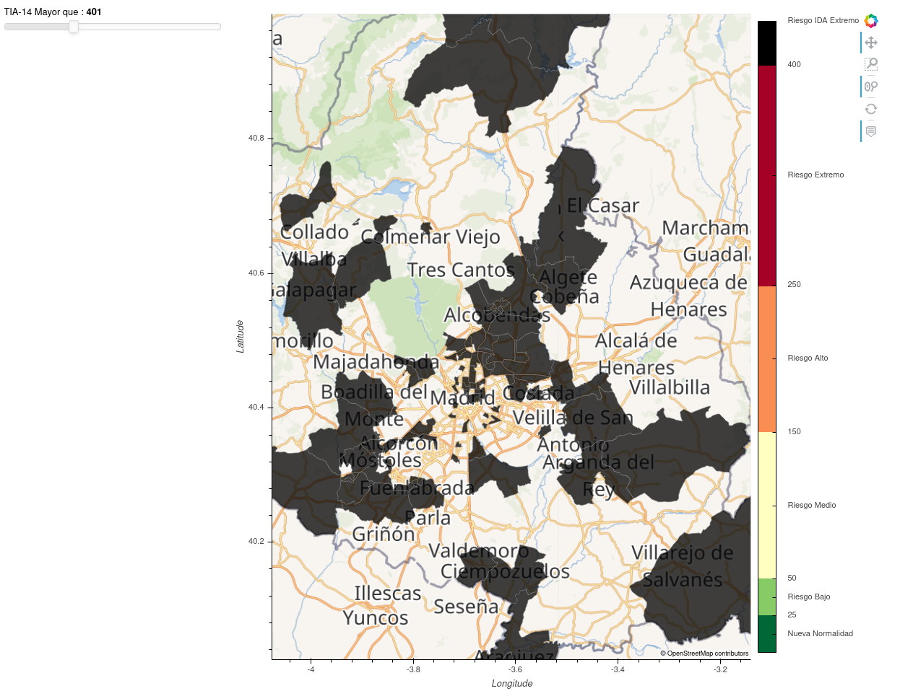

# ZBS_Madrid

Zonas Basicas de Salud con python

###  Comunidad de Madrid

#### Vamos a usar python y alguna de sus librerías para crear una representación gráfica de datos sobre un mapa.

##### Para ello necesitamos:

    1. Un mapa base.
    2. Shape de cada área del mapa.
    3. Datos a representar de cada área/shape.
    4. Asociar los datos de ZBS a cada shape.
    5. Mapa con los datos.

#### En este caso, serán datos de situación del COVID-19 en las Zonas Básicas de Salud de la Comunidad de Madrid.
### Necesitamos datos:
- Los shapes de las Zonas Básicas de Salud que forman el mapa de la Comunidad de Madrid.
- Un dato a representar en el mapa. He escogido la Tasa de Incidencia Acumulada en los últimos 14 días. Esta serie de datos se llamará **TIA-14**.

### Necesitamos librerías que nos permitan acceder a los datos, procesarlos y presentarlos de manera interactiva:
- Podemos usar datos en local ó acceder a ellos a traves de su url pública. En este caso será con ficheros locales.

## Crearemos un Mapa Base 

----
----
## Crearemos un Mapa con los shapes de la CAM

----
----

## Cargaremos los datos de COVID y los presentaremos

## Además exportamos al final un fichero html, independiente e interactivo! ;)
[ZBS_Madrid.html](ZBS_Madrid.html)

## Filtramos las ZBS que superan el umbral
